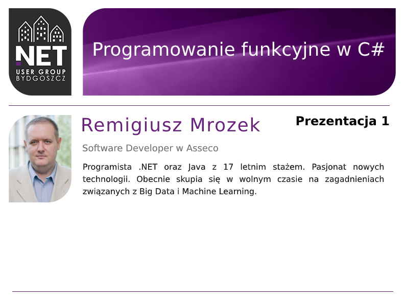
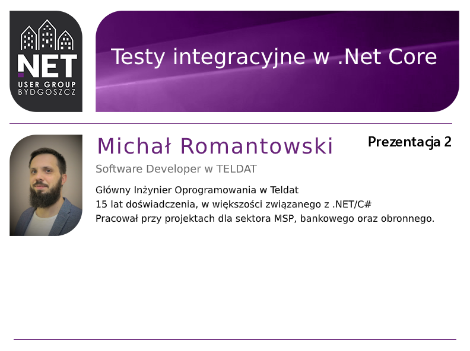

## 10. spotkanie Bydgoszcz .Net User Group

[Link do nagrania na Facebook](https://www.facebook.com/BydgoszczNETUserGroup/videos/423236602036609)

### Materiały

 - [Przykładowy projekt](https://github.com/mrozim78/ExampleFunctionalProgramming)
 - [Przydatna biblioteka](https://github.com/louthy/language-ext)

### Materiały

- [Przykładowy projekt](https://github.com/mromantowski/ASPNETCoreIntegrationTesting)

[Strona główna](/)
